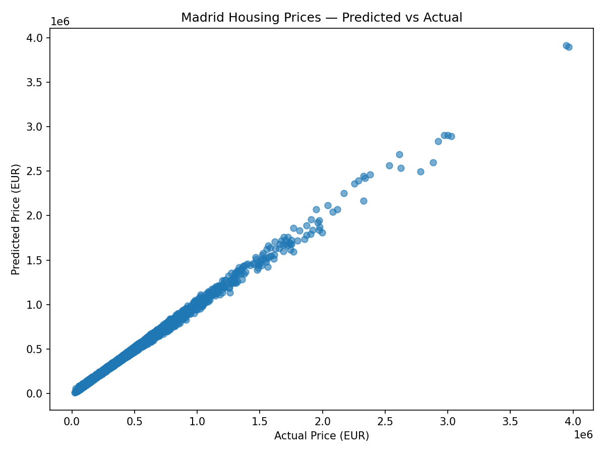
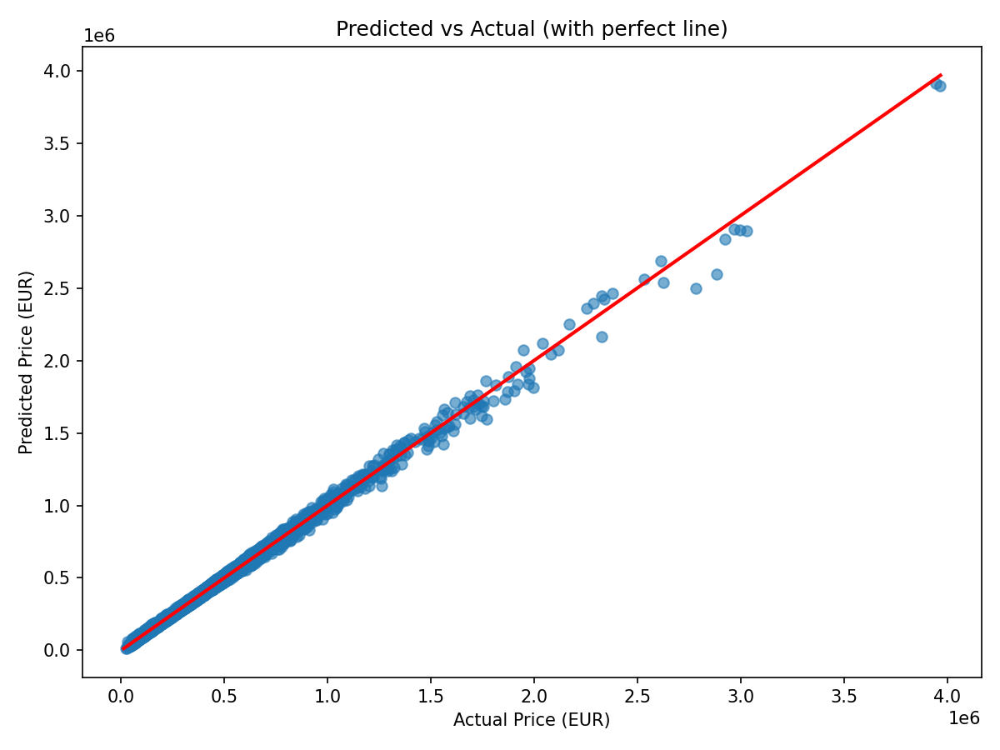

'''
# Madrid Housing Market Dataset (2015-2025)

This document provides a detailed overview of the generated Madrid housing dataset, including the assumptions made during its creation and a comprehensive data dictionary for all features.

## Assumptions

1.  **Data Synthesis**: While grounded in real-world data for district-level pricing and macroeconomic trends, the individual property listings are synthetic. The generation process uses statistical methods (normal, gamma, and uniform distributions) to create realistic variations based on established parameters.

2.  **Price Modeling**: The core of the price generation is a multiplicative model starting with a `base_price_per_sqm` for each district (calibrated to 2024 averages). This base price is then adjusted based on:
    *   **Temporal Factors**: A historical price index derived from INE and market reports adjusts prices for each year.
    *   **Property Features**: Multipliers are applied for characteristics like property type (e.g., an `Ático` is more expensive), building condition, and amenities (e.g., having a pool or parking).
    *   **Location**: A decay function reduces the price as the distance from the city center (Puerta del Sol) increases.

3.  **Macroeconomic Impact**: The model incorporates a direct link between macroeconomic indicators and housing prices. The `ECB_Interest_Rate` and `Inflation_Rate_Spain` for each year are included, and the overall price index reflects their historical impact. For instance, the period of low interest rates (2016-2021) correlates with rising house prices.

4.  **Neighborhood Simulation**: Specific neighborhoods within districts are not explicitly modeled from real-world data. Instead, they are simulated by adding a slight random geographical "jitter" (normally distributed noise) to the latitude and longitude of the parent district's center.

5.  **Index Synthesis**: Some indices, like `Housing_Supply_Index`, `Crime_Index`, `School_Quality_Index`, `Pollution_Index`, and `Noise_Index`, are synthetic. They are generated based on the "tier" of the district (Premium, Mid, Lower) and are designed to be correlated with price, reflecting that more desirable areas generally have better scores on these metrics.

## Data Dictionary

| Feature | Description | Type | Example | Notes |
| :--- | :--- | :--- | :--- | :--- |
| **Price_EUR** | **Target Variable.** The final transaction price of the property in Euros. | `Float` | `450000.00` | This is the main variable to be predicted. |

### 1. Property Characteristics

| Feature | Description | Type | Example | Notes |
| :--- | :--- | :--- | :--- | :--- |
| `Size_m2` | The gross floor area of the property in square meters. | `Float` | `85.5` | Correlated with `Bedrooms` and `Bathrooms`. |
| `Bedrooms` | The number of bedrooms in the property. | `Integer` | `3` |  |
| `Bathrooms` | The number of bathrooms in the property. | `Integer` | `2` |  |
| `Floor_Level` | The floor number on which the apartment is located. | `Integer` | `4` | `0` for ground floor (`Bajo`) or single-level houses (`Chalet`). |
| `Elevator` | Whether the building has an elevator. | `String` | `Yes` / `No` | Strongly impacts price, especially for higher floors in older buildings. |
| `Property_Type` | The type of residential property. | `String` | `Piso` | Categories: `Piso`, `Ático`, `Bajo`, `Duplex`, `Chalet`. |
| `Year_Built` | The year the building was originally constructed. | `Integer` | `1965` |  |
| `Renovation_Year` | The year the property was last renovated. | `Integer` | `2018` | `0` if never renovated or not applicable. |
| `Building_Condition` | The overall condition of the building. | `String` | `Good` | Categories: `New`, `Good`, `Needs Renovation`. |
| `Energy_Rating` | The energy efficiency rating of the property. | `String` | `D` | Scale from `A` (most efficient) to `G` (least efficient). |
| `Heating_Type` | The primary type of heating system. | `String` | `Gas` | Categories: `Gas`, `Electric`, `Heat Pump`, `Central`. |
| `Air_Conditioning` | Whether the property has air conditioning. | `String` | `Yes` / `No` |  |

### 2. Location Features

| Feature | Description | Type | Example | Notes |
| :--- | :--- | :--- | :--- | :--- |
| `Neighborhood` | A simulated neighborhood name. | `String` | `Salamanca_Nbh` | For modeling purposes; not real neighborhood names. |
| `District` | The Madrid district where the property is located. | `String` | `Salamanca` | Based on official Madrid districts. |
| `Latitude` | The geographic latitude of the property. | `Float` | `40.4297` |  |
| `Longitude` | The geographic longitude of the property. | `Float` | `-3.6797` |  |
| `Distance_Metro_meters` | The distance in meters to the nearest Metro station. | `Float` | `350.5` |  |
| `Distance_Cercanias_meters` | The distance in meters to the nearest Cercanías (commuter rail) station. | `Float` | `1200.0` |  |
| `Distance_CityCenter_km` | The distance in kilometers to the city center (Puerta del Sol). | `Float` | `1.5` |  |

### 3. Neighborhood Quality Indicators

| Feature | Description | Type | Example | Notes |
| :--- | :--- | :--- | :--- | :--- |
| `Crime_Index` | A synthetic index representing crime levels (lower is better). | `Float` | `25.5` |  |
| `School_Quality_Index` | A synthetic index for the quality of nearby schools (higher is better). | `Float` | `80.1` |  |
| `Pollution_Index` | A synthetic index for air and environmental pollution (lower is better). | `Float` | `55.0` |  |
| `Noise_Index` | A synthetic index for noise levels (lower is better). | `Float` | `60.0` |  |
| `Distance_GreenArea_meters` | The distance in meters to the nearest significant park or green area. | `Float` | `250.0` |  |

### 4. Amenities

| Feature | Description | Type | Example | Notes |
| :--- | :--- | :--- | :--- | :--- |
| `Balcony` | Whether the property has a balcony. | `String` | `Yes` / `No` |  |
| `Terrace` | Whether the property has a terrace. | `String` | `Yes` / `No` | More common in `Ático` properties. |
| `Garden` | Whether the property has a private garden. | `String` | `Yes` / `No` | More common in `Chalet` or `Bajo` properties. |
| `Parking` | Whether the property includes a parking space. | `String` | `Yes` / `No` | A significant premium, especially in central districts. |
| `Storage_Room` | Whether the property includes a storage room (`trastero`). | `String` | `Yes` / `No` |  |
| `Pool` | Whether the building or property has a swimming pool. | `String` | `Yes` / `No` |  |
| `Concierge` | Whether the building has a concierge service. | `String` | `Yes` / `No` |  |

### 5. Market Features

| Feature | Description | Type | Example | Notes |
| :--- | :--- | :--- | :--- | :--- |
| `Listing_Date` | The date the property was listed for sale. | `String` | `2023-05-15` | Format: YYYY-MM-DD. |
| `Listing_Year` | The year of the listing. | `Integer` | `2023` |  |
| `Listing_Month` | The month of the listing. | `Integer` | `5` |  |
| `ECB_Interest_Rate` | The European Central Bank's main refinancing operations rate at the time of listing. | `Float` | `4.50` |  |
| `Inflation_Rate_Spain` | Spain's annual inflation rate (HICP) for the listing year. | `Float` | `3.5` |  |
| `Housing_Supply_Index` | A synthetic index representing the relative supply of housing on the market. | `Float` | `95.2` |  |
| `Mortgage_Rate` | An estimated mortgage interest rate for the consumer. | `Float` | `5.52` | Modeled as `ECB_Interest_Rate` + a fixed spread + random noise. |

### 6. Transaction Features

| Feature | Description | Type | Example | Notes |
| :--- | :--- | :--- | :--- | :--- |
| `Days_On_Market` | The number of days the property was listed before being sold. | `Integer` | `95` |  |
| `Negotiation_Discount_pct` | The percentage discount from the last asking price to the final sale price. | `Float` | `4.5` |  |
| `Previous_Sale_Price` | A simulated price from a previous sale, for calculating appreciation. | `Float` | `385000.00` |  |

### 7. External Environment

| Feature | Description | Type | Example | Notes |
| :--- | :--- | :--- | :--- | :--- |
| `Distance_Hospital_km` | The distance in kilometers to the nearest major hospital. | `Float` | `2.1` |  |
| `Distance_CommercialArea_km` | The distance in kilometers to a major shopping or commercial area. | `Float` | `0.8` |  |
| `Distance_Park_meters` | The distance in meters to the nearest park. (Duplicate of `Distance_GreenArea_meters`). | `Float` | `250.0` |  |

---

## Model Results

We built a predictive model that learns from 22,000 past property transactions in Madrid — looking at the size, location, district, amenities, condition, and economic climate of each sale — and uses those patterns to estimate what a property should sell for.

### How accurate is the model?

| Metric | Value | What it means |
| :--- | :--- | :--- |
| **R-squared (R²)** | **0.9962** | The model explains **99.6 %** of the variation in housing prices. In other words, nearly all price differences between properties can be accounted for by the features in the dataset. |
| **Root Mean Squared Error (RMSE)** | **~20,066 EUR** | On average, the model's estimate is about **20,000 EUR** away from the actual sale price. For a market where properties range from under 50,000 EUR to over 3,000,000 EUR, this is a very small margin of error. |

### Predicted vs Actual Prices

The chart below plots every property in the test set (4,400 transactions the model had never seen before). Each dot represents one property: its horizontal position is the real sale price, and its vertical position is the price the model predicted.

If the model were perfect, every dot would sit exactly on a straight diagonal line from bottom-left to top-right. As you can see, the dots form a tight band along that diagonal — the model tracks real prices very closely across the entire price range, from affordable flats in peripheral districts to premium properties in Salamanca or Chamberí.

### Predicted vs Actual (with reference line)

This is the same chart with a red "perfect prediction" line drawn in. Dots that land on the red line were predicted exactly right; dots above the line were slightly overestimated, and dots below it were slightly underestimated.

**Key takeaways for business users:**

- **The model is highly reliable.** For the vast majority of properties (those priced up to roughly 1.5 M EUR), predictions cluster tightly around the red line with very little spread.
- **Luxury properties show slightly more variation.** Above 2 M EUR there are fewer comparable transactions to learn from, so individual estimates may differ from the actual sale price by a larger amount — though the overall direction remains accurate.
- **Practical use.** This model can confidently support property valuations, portfolio assessments, and investment screening across Madrid's market. A typical estimate will be within about 20,000 EUR of the final transaction price.

'''
